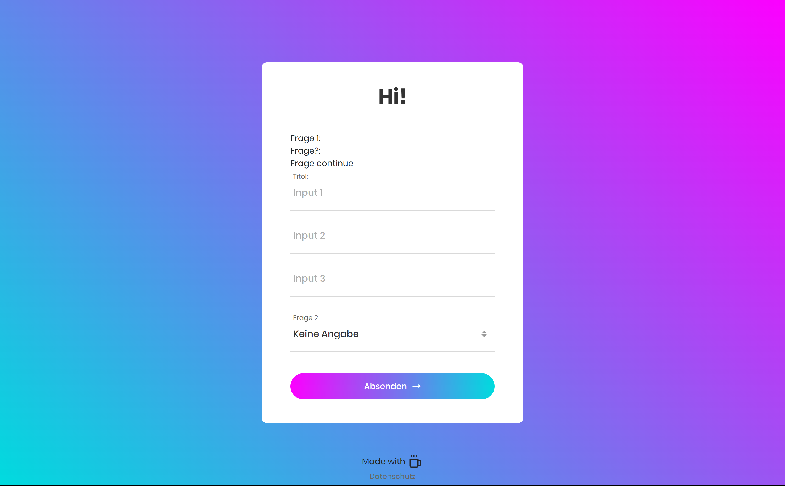

# Surfing Surveys

What's cooler than using platforms like Forms for your surveys? - Hosting your own.
SurfingSurveys is a starter template for your own surveys built on NodeJS with Handlebars. 

Features:
- Routing for main Form
- Routing and Template for Data Privacy
- EasterEgg for no reason at all
- CSS Design

## Current design:
